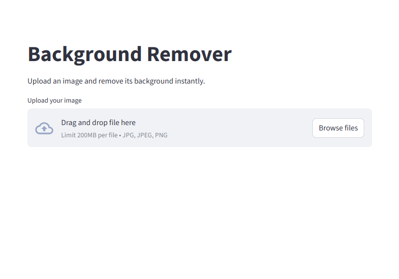

# 🖼 Background Remover App

This is a simple **Background Remover** project built using Python, Streamlit, and Rembg.  
It allows you to upload an image, remove its background, and download the output.

---

## 🚀 Features
- Upload JPG/PNG images
- Remove background with one click
- Download the processed image
- Works on Windows, macOS, and Linux

---

## 📂 Project Structure
```
background_remover/
│── app.py              # Main application file
│── requirements.txt    # Required libraries
```

---

## ⚙️ Installation & Setup

### 1. Clone the repository
```bash
git clone https://github.com/deecodenow1/background-remover.git
cd background-remover
```

### 2. Create virtual environment (recommended)

#### Windows (PowerShell)
```bash
python -m venv venv
venv\Scripts\activate
```

#### macOS / Linux
```bash
python3 -m venv venv
source venv/bin/activate
```

### 3. Install dependencies
```bash
pip install -r requirements.txt
```

### 4. Run the app
```bash
python -m streamlit run app.py
```

---

## 📦 Requirements
All dependencies are listed in `requirements.txt`:

- rembg==2.0.57
- pillow==10.2.0
- ttkbootstrap==1.10.1
- streamlit==1.35.0
- onnxruntime==1.16.3

---

## 🖼 Preview


---

## 🤝 Contributing
Feel free to fork this repo and improve it. Pull requests are welcome!

---

## 📜 License
This project is licensed under the MIT License.
